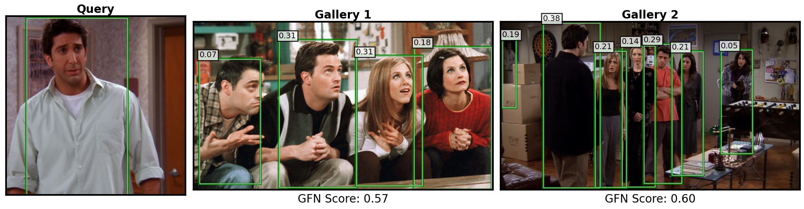
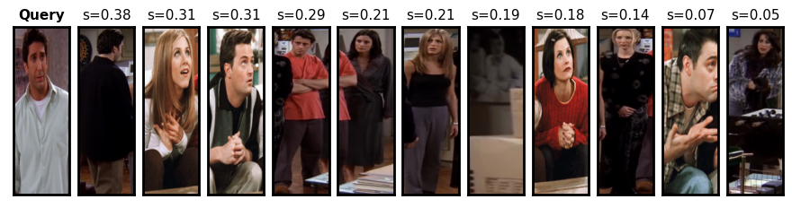
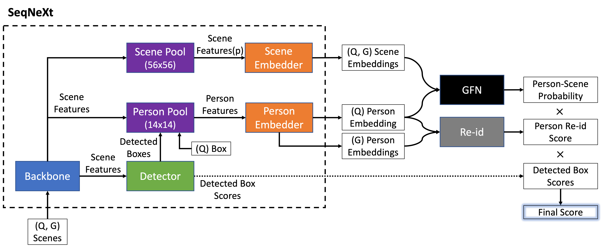

# Gallery Filter Network for Person Search

[](https://paperswithcode.com/sota/person-search-on-cuhk-sysu?p=gallery-filter-network-for-person-search) [](https://paperswithcode.com/sota/person-search-on-prw?p=gallery-filter-network-for-person-search)

This repo implements person search models from the paper, "Gallery Filter Network for Person Search" ([arXiv version](https://arxiv.org/abs/2210.12903), [WACV23 version](https://openaccess.thecvf.com/content/WACV2023/html/Jaffe_Gallery_Filter_Network_for_Person_Search_WACV_2023_paper.html)).
The Object Search Research (OSR) package implements data prep, training, and inference for the CUHK-SYSU and PRW datasets. The package is easily extensible to other datasets.

We achieve state-of-the-art results on the benchmark CUHK-SYSU and PRW datasets, shown below, with
downloadable model checkpoints. Metrics are computed with and without the Gallery Filter Network (GFN).

| Dataset   | Backbone      | mAP  | Top-1 | mAP (+GFN) | Top-1 (+GFN) | Checkpoint | Torchscript |
| --------- | ------------- | ---- | ----- | --------- | ----------- | ----- | --- |
| PRW       | ConvNeXt Base | 57.6 | 89.5  | 58.3      | 92.4        | [link](https://drive.google.com/file/d/1DWuruI2gjCkhZOkXMpvRG0mEnKtYZKFO/view?usp=share_link) | [link](https://drive.google.com/file/d/1rViqjC_VUDPwy4DS631JJnyZ8FDp5hCB/view?usp=share_link) |
| PRW       | ResNet50      | 50.8 | 86.0  | 51.3      | 90.6        | --- | --- |
| CUHK-SYSU | ConvNeXt Base | 96.1 | 96.5  | 96.4      | 97.0        | [link](https://drive.google.com/file/d/1TmrCCXteUccr3smG9SLrM5bR_qsu9lzu/view?usp=share_link) | [link](https://drive.google.com/file/d/1pmka6VZmmxaQnuxsxQ_qOUjXN21mbav-/view?usp=share_link) |
| CUHK-SYSU | ResNet50      | 94.1 | 94.7  | 94.7      | 95.3        | --- | --- |

## Demo
The [jupyter notebook](./notebooks/web_demo.ipynb) in ./notebooks/web_demo.ipynb downloads images from arbitrary URLs and performs person search and GFN scoring using a torchscript version of the model (link above). An example is shown below.  

### Person Detection
In person search, our goal is to locate a query person in a set of scene images called a gallery.

Person bounding boxes are detected, embeddings are extracted, and gallery person embeddings are compared to query person embeddings using cosine similarity. This cosine similarity is shown in the top left of detected boxes below.

In addition, query person and gallery scene embeddings are compared by the GFN to produce a person-scene score. This GFN score is shown below each gallery image.



### Person Re-Identification
Then, detected persons are ranked by similarity to the query person. In this example, we can see the top match is correct.



## Model Architecture
The model architecture is a standard end-to-end person search architecture based on the SeqNet model, which takes query (Q) and gallery (G) scenes, detects and extracts person embeddings, and compares embeddings for re-id. An additional branch is added to this model to compute scene embeddings, which are used by the GFN to compute person-scene scores.



## Installation
The OSR package can be installed with docker or conda.
We provide example install instructions below, so the user can use
the commands in setup.py out of the box. 

### docker
```
host$ docker build --no-cache -t osr:v1.0.0 -f Dockerfile .

host$ docker run -it --rm \
        --ulimit core=0 \
        --name=osr_$(date +%F_%H-%M-%S) \
        --runtime=nvidia \
        --net=host \
        -v /dev/shm:/dev/shm \
        -v <PRW_PATH>:/datasets/prw \
        -v <CUHK_PATH>:/datasets/cuhk \
        -v $(pwd)/weights:/weights/hub \
        -v $(pwd):/home/username \
        -w /home/username \
        osr:v1.0.0 bash -c \
                "chown -R $(id -u):$(id -g) /home/username;\
                 groupadd -g $(id -g) groupname;\
                 useradd -u $(id -u) -g $(id -g) -d /home/username username;\
                 su username -s /bin/bash;"

container$ export PATH=${PATH}:/opt/conda/bin
```

You can also re-install in the container with:
```
container$ python3 setup.py install --user
```

### conda
```
(base)$ conda env create -f conda.yaml

(base)$ conda activate osr

(osr)$ python3 setup.py install --user
```

## Data Download
Optionally install gdown python package for easy download of the datasets from google drive.
```
pip install --user gdown
```

### [PRW](https://github.com/liangzheng06/PRW-baseline)
```
cd $DATASET_DIR
gdown https://drive.google.com/uc?id=0B6tjyrV1YrHeYnlhNnhEYTh5MUU
unzip PRW-v16.04.20.zip -d prw
```

### [CUHK-SYSU](https://github.com/ShuangLI59/person_search)
```
cd $DATASET_DIR 
gdown https://drive.google.com/uc?id=1z3LsFrJTUeEX3-XjSEJMOBrslxD2T5af 
tar -xzvf cuhk_sysu.tar.gz -C cuhk
```

## Data Prep
After docker or conda installation of the package above, simply run:
```
osr_prep_cuhk --dataset_dir ${DATASET_DIR}/cuhk
osr_prep_prw --dataset_dir ${DATASET_DIR}/prw
```

## Config
For training and inference, we use .yaml files for the config format, with examples in the ./configs dir.
Config files inherit from ./configs/default.yaml, which has all possible parameters, with documentation.

To train or test, make sure to first modify the dataset_dir in the target config .yaml.

We include config files for all the experiments in the main paper:

    - baseline model
    - final model
    - augmentation ablation
    - crop size ablation
    - GFN objective ablation
    
Some configs group params together for easy running with ray tune grid_search. Additional config files, e.g., from supplementary experiments, are available upon request.

## Training
To train the final models:
```
osr_run --trial_config=./configs/cuhk_train_final.yaml
osr_run --trial_config=./configs/prw_train_final.yaml
```

## Inference
Trained model checkpoints for the final models are available at the google drive links above in the results table. To test, you may use one of these checkpoints, or run the training script, then modify the checkpoint path in the test .yaml files to the resulting training checkpoint.

To test the final models:
```
osr_run --trial_config=./configs/cuhk_test_final.yaml
osr_run --trial_config=./configs/prw_test_final.yaml
```

## Acknowledgment
Thanks to the authors of the following repos for their code, which was integral in this project:
- [SeqNet](https://github.com/serend1p1ty/SeqNet)
- [torchvision](https://github.com/pytorch/vision)
- [albumentations](https://github.com/albumentations-team/albumentations)
- [pytorch_metric_learning](https://github.com/KevinMusgrave/pytorch-metric-learning)

## Citation
```
@InProceedings{Jaffe_2023_WACV,
    author    = {Jaffe, Lucas and Zakhor, Avideh},
    title     = {Gallery Filter Network for Person Search},
    booktitle = {Proceedings of the IEEE/CVF Winter Conference on Applications of Computer Vision (WACV)},
    month     = {January},
    year      = {2023},
    pages     = {1684-1693}
}
```

## License
This repository uses the MIT license.

Additional required notice: THIS SOFTWARE AND/OR DATA WAS DEPOSITED IN THE BAIR OPEN RESEARCH COMMONS REPOSITORY ON 10/24/2022.